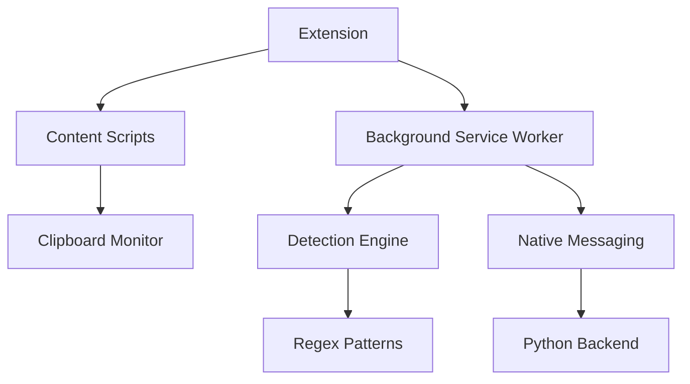

# Phase 2: Chromium Extension Implementation Plan

## 1. Project Objectives
- Seamless integration with Phase 1 detection logic
- Real-time clipboard monitoring with <100ms latency
- Cross-browser support (Chrome, Edge, Firefox)
- Manifest V3 compliance
- End-to-end encryption for sensitive data

## 2. Technical Requirements

## 3. Architecture Components
| Component | Technology Stack | Responsibility |
|-----------|------------------|----------------|
| Content Script | TypeScript | DOM interaction & UI |
| Service Worker | Workbox | Background processing |
| Detection Core | WebAssembly | Pattern matching |
| Storage | IndexedDB | Configuration persistence |

## 4. Development Milestones
1. Week 1-2: Core architecture setup
2. Week 3-4: Detection logic porting
3. Week 5: UI/UX implementation
4. Week 6: Cross-browser testing
5. Week 7: Security audit
6. Week 8: Store submission

## 5. Cross-Browser Strategy
- WebExtensions API polyfill
- Browser-specific manifest variants
- Feature detection fallbacks

## 6. Security Protocols
- Permission Whitelist:
  - `clipboardRead`
  - `clipboardWrite`
  - `storage`
- Data Sanitization:
  - DOMPurify integration
  - Content Security Policy
- Encryption:
  - WebCrypto API for sensitive data

## 7. QA Testing Matrix
| Scenario | Test Case | Validation Criteria |
|----------|-----------|---------------------|
| Basic Detection | Paste C# code | Proper code fencing |
| Mixed Content | Code+text combo | Correct segmentation |
| Performance | 10KB+ input | <200ms processing |

## 8. Deployment Pipeline
1. CI/CD: GitHub Actions
2. Packaging: Webpack + CRXJS
3. Store Requirements:
   - Privacy policy
   - Demo video
   - 128px icon set

## 9. Monitoring Plan
- Sentry error tracking
- User feedback portal
- Automated update rollouts
- Monthly usage reports

## 10. Deliverables
- `/extension` - Core codebase
- `/docs` - Technical specifications
- `/test` - Cypress test suite
- `DEPLOYMENT.md` - Store submission guide